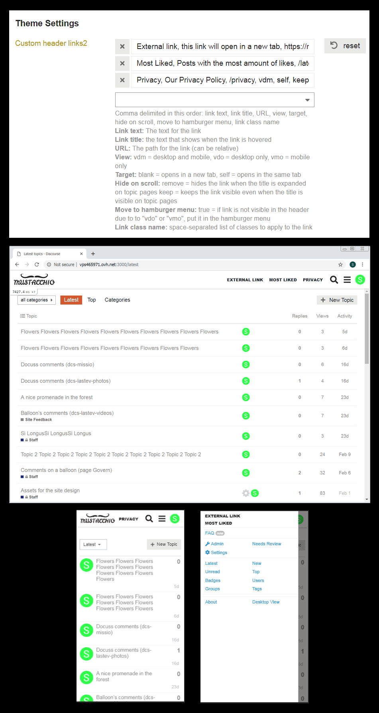

# discourse-custom-header-links2

This is a Discourse theme component allowing to add custom text-based links to the header.

It is a fork of the original
[discourse/discourse-custom-header-links](https://github.com/discourse/discourse-custom-header-links),
with two additional features:

- Links not showing up on mobile or desktop are moved to the Discourse hamburger
  menu (if specified in settings).
- A user-defined class can be set for links.

## Setup
If you are using the original component, all you need to do is to copy your
former settings to the new component and add "`, true`" at the end of each link
definition. This will enable the "move to hamburger menu" feature.

Further documentation can be found here:
- https://meta.discourse.org/t/how-do-i-install-a-theme-or-theme-component/63682
- https://meta.discourse.org/t/custom-header-links/90588

## Screenshots

